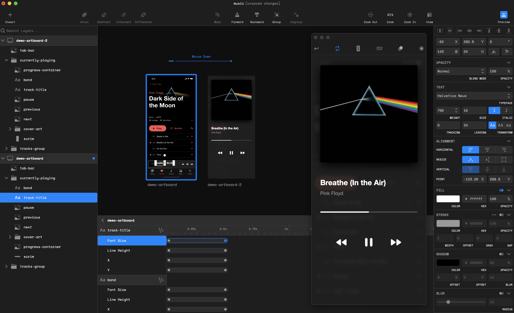

# btwx

Product Designer animation and prototyping tool.

## Features

- Basic vector editing with boolean and mask support
- Smart snap and measure
- gsap animations
  - Supported tween property params
    - Ease
    - Duration
    - Delay
    - Repeat
    - Yoyo
- Device frames
  - iPhone
  - Apple Watch
  - iPad
- Screen recording
- Auto save
- Light and dark themes
- Sketch support - [Plugin](https://github.com/endswithak/btwx-sketch-plugin)
- Custom key bindings

## Getting Started

- [Download btwx](../../releases/v1.2.3-beta) (Only tested on macOS)
- Open btwx
- Add two or more artboards with child layers of the same name and type
- Add event listeners to child layers
- Edit and preview event

## How it works

Each event you create has an event listener, origin, and destination. When the event listener is triggered, any layers with the same name and type shared between the origin and destination will animate from the origin layer state to the destination layer state.

## Supported Event Listeners

- Mouse down
- Mouse up
- Mouse drag
- Mouse enter
- Mouse leave
- Click
- Double click
- Right click

## Supported Tween Props

- X
- Y
- Rotation
- Width
- Height
- Scale X (horizontal flip)
- Scale Y (vertical flip)
- Shape
  - With gsap morph svg plugin
- Fill
  - Color
  - Gradient
    - Origin
      - X
      - Y
    - Destination
      - X
      - Y
- Stroke
  - Color
  - Gradient
    - Origin
      - X
      - Y
    - Destination
      - X
      - Y
- Stroke width
- Dash offset
- Dash array
  - Width
  - Gap
- Shadow
  - Color
  - Blur
  - Offset
    - X
    - Y
- Opacity
- Blur
- Font size
- Font weight
- Letterspacing
- Leading
- Text
  - With gsap text and scramble text plugins

## Roadmap

- Text tweens
  - Oblique
  - Justification
  - Vertical alignment
  - Split text plugin support
- Image tweens
- Web version
- Draw svg plugin support
- Gradient tweens
  - Granular stop editing
- More device frames

## Built with

- [ERB](https://github.com/electron-react-boilerplate/electron-react-boilerplate)
- [GSAP](https://greensock.com/)
- [paper.js](https://github.com/paperjs/paper.js)