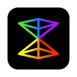

# btwx

Product Designer animation and prototyping tool.

## How It Works

Events and tweens are the bread and butter of btwx. Events can be added to any layer aside from groups and have four main properties: trigger layer, event listener, origin, and destination. When the event listener (e.g. click, double click, drag) is initiated on the trigger layer, any layers with the same name and type shared between the origin and destination will animate from the origin layer state to the destination layer state.

Comprising each event are layer property tweens (e.g. x, y, width, height), which are automatically added when any origin layer property does not match its’ corresponding destination layer property. Tweens can be customized in a multitude of ways depending on the property. The most basic options include duration, delay, ease, repeat, and repeat yoyo. When layer properties match, wiggle tweens can be added. Wiggle tweens work just like regular tweens but with an added strength option. In general, the larger the difference between the property and the strength, the stronger the wiggle.

Adding Event

Events

Tweens

Tween Handles

Ease Selector

Ease Options

Wiggle Tween

Text Tween

Scramble Text Tween

Group Merged Tweens

Group Scroll

Preview

Preview Frame

Screen Recording

Search

Preferences

Key Bindings

Light Theme

## Supported Event Listeners

- Mouse down
- Mouse up
- Mouse drag
- Mouse enter
- Mouse leave
- Click
- Double click
- Right click

## Supported Tween Properties

- X
- Y
- Rotation
- Width
- Height
- Scale X (horizontal flip)
- Scale Y (vertical flip)
- Shape
  - With gsap morph svg plugin
- Fill
  - Color
  - Gradient
    - Origin
      - X
      - Y
    - Destination
      - X
      - Y
- Stroke
  - Color
  - Gradient
    - Origin
      - X
      - Y
    - Destination
      - X
      - Y
- Stroke width
- Dash offset
- Dash array
  - Width
  - Gap
- Shadow
  - Color
  - Blur
  - Offset
    - X
    - Y
- Opacity
- Blur
- Font size
- Font weight
- Letterspacing
- Leading
- Text
  - With gsap text and scramble text plugins

## Other Features

- Basic vector editing with boolean and mask support
- Smart snap and measure
- Device frames
  - iPhone
  - Apple Watch
  - iPad
- Screen recording
- Auto save
- Sketch support - [Plugin](https://github.com/endswithak/btwx-sketch-plugin)
- Custom key bindings

## Getting Started

- [Download btwx](../../releases/v1.3.0-beta) (Only tested on macOS)
- Open btwx
- Add two or more artboards with child layers of the same name and type
- Add event to child layer
- Edit and preview event

## Built with

- [ERB](https://github.com/electron-react-boilerplate/electron-react-boilerplate)
- [GSAP](https://greensock.com/)
- [paper.js](https://github.com/paperjs/paper.js)